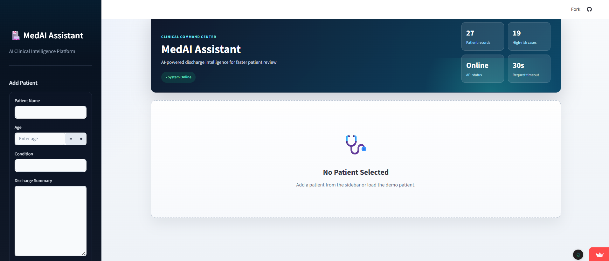
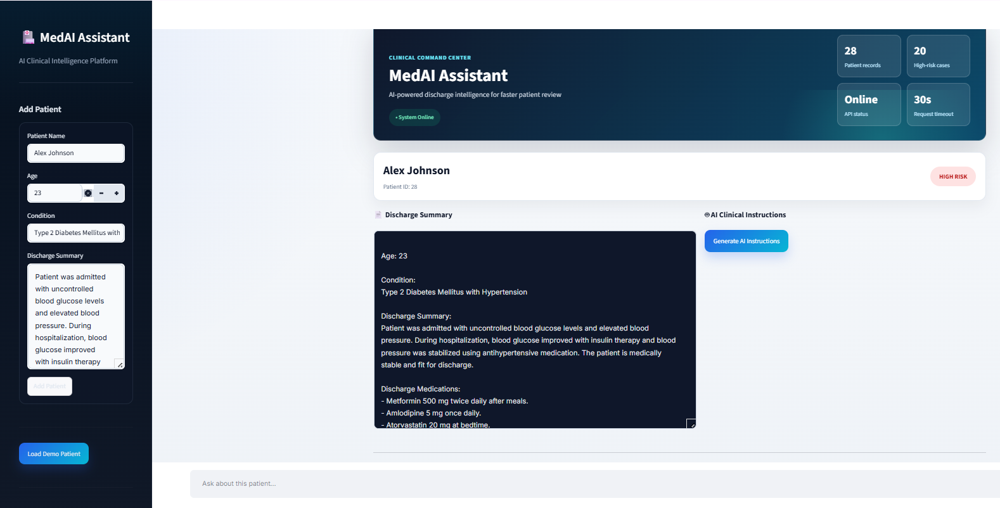
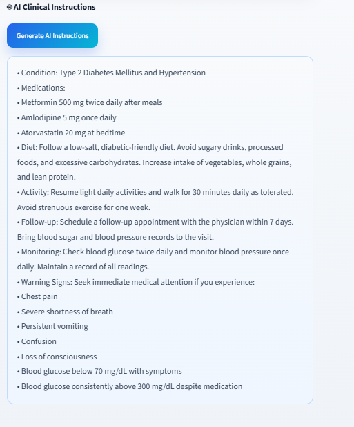
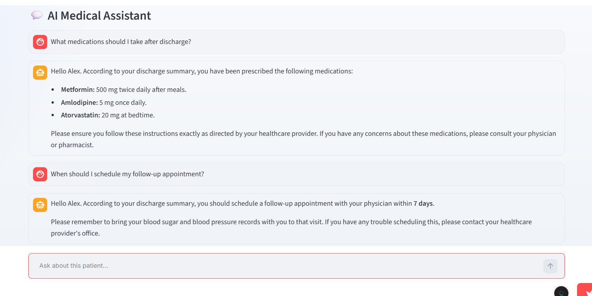

<div align="center">

# MedAI Assistant

**An AI-powered post-discharge care assistant that transforms complex hospital discharge summaries into simple, structured follow-up guidance, risk insights, and patient-specific question answering.**

[](https://medai-assistant-w6hqdj4lg7gawdpgjrvde2.streamlit.app/)
[](https://med-ai-assistant-pi.vercel.app/health)

[](https://python.org)
[](https://streamlit.io)
[](https://fastapi.tiangolo.com)
[](https://www.docker.com/)
[](https://ai.google.dev/)

</div>
---

# Live Demo

**Live Application**

https://medai-assistant-w6hqdj4lg7gawdpgjrvde2.streamlit.app/

**Backend API**

https://med-ai-assistant-pi.vercel.app/health

**API Documentation**

https://med-ai-assistant-pi.vercel.app/docs

# Problem Statement

After patients are discharged from a hospital, they often receive lengthy medical reports filled with complex terminology, medication instructions, follow-up schedules, and warning signs. Many patients and caregivers struggle to understand these reports, which can lead to medication mistakes, missed follow-up appointments, unnecessary hospital visits, or delayed medical attention.

MedAI Assistant addresses this problem by using Generative AI to convert complex discharge summaries into clear, structured, patient-friendly guidance. It also allows patients to ask follow-up questions in natural language while providing simple risk insights based on the discharge information.

The application is intended for educational purposes and demonstrates how AI can improve communication between healthcare providers and patients.

# Overview

MedAI Assistant is a full-stack AI healthcare application built with Streamlit, FastAPI, SQLAlchemy , Docker, and Google Gemini.

The application allows healthcare professionals or students to upload patient discharge summaries, securely store patient information, generate AI-powered follow-up care instructions, calculate simple risk levels, and interact with an intelligent patient-specific assistant.

Rather than replacing healthcare professionals, MedAI Assistant focuses on improving patient understanding by transforming technical medical language into structured and easy-to-understand guidance.

# Target Users

- Patients after hospital discharge
- Family caregivers
- Medical students
- Healthcare professionals
- AI developers exploring healthcare applications

## Features

- Multi-patient dashboard built with Streamlit
- FastAPI REST backend deployed on Vercel
- Dockerized Streamlit app for reproducible local/container runs
- SQLAlchemy persistence with local SQLite or hosted PostgreSQL
- AI-powered discharge instruction generation
- Patient-specific AI chat with recent conversation memory
- Rule-based risk labels: `LOW`, `MEDIUM`, `HIGH`
- Backend health endpoint for deployment debugging
- Safer medical prompt framing and basic prompt-injection resistance

  # AI Feature

MedAI Assistant uses **Google Gemini 2.5 Flash** to perform intelligent analysis of hospital discharge summaries.

The AI is responsible for:

- Generating structured follow-up instructions
- Explaining medical information in simple language
- Answering patient-specific follow-up questions
- Using recent conversation memory for contextual responses
- Providing safe healthcare guidance while avoiding unsupported medical claims

The application combines AI-generated responses with rule-based risk detection to provide more structured follow-up recommendations.

# AI System Prompts

The AI behaviour is guided using two prompt templates.

## Discharge Analysis Prompt

The model is instructed to:

- Convert hospital discharge summaries into structured follow-up instructions.
- Use only the information contained in the discharge summary.
- Never invent medications, diagnoses, or medical advice.
- Produce concise bullet-point responses.
- Return "Not specified" whenever information is unavailable.

Output format:

- Condition
- Medications
- Diet
- Activity
- Follow-up
- Monitoring
- Warning Signs

---

## Patient Chat System Prompt

The conversational assistant is instructed to:

- Answer questions using the patient's discharge summary.
- Keep responses short, clear, and easy to understand.
- Never invent medical information.
- Never provide medical diagnoses.
- Inform the user when requested information is unavailable.
- Recommend consulting healthcare professionals whenever appropriate.
- Advise immediate medical attention if severe warning symptoms are mentioned.

# Application Workflow

1. User enters patient information and discharge summary.

2. Patient data is stored in the database.

3. A rule-based algorithm calculates the patient's risk level.

4. Google Gemini analyzes the discharge summary.

5. AI generates structured follow-up instructions.

6. Users can ask additional patient-specific questions.

7. The AI answers using both the discharge summary and recent conversation history.

## Architecture

```text
Streamlit Cloud
  app.py
  API_URL secret
       |
       | HTTPS
       v
Vercel FastAPI
  index.py -> backend.api:app
  GOOGLE_API_KEY secret
  DATABASE_URL secret
       |
       v
Hosted PostgreSQL
  Neon, Supabase, Railway, or another provider
```

## Project Structure

```text
.
|-- app.py                    # Streamlit frontend
|-- index.py                  # Vercel entrypoint for FastAPI
|-- vercel.json               # Vercel Python routing
|-- Dockerfile                # Container image for the Streamlit app
|-- .dockerignore             # Keeps secrets and local files out of Docker builds
|-- backend/
|   |-- api.py                # FastAPI app and CORS
|   |-- crud.py               # Database operations
|   |-- database.py           # SQLAlchemy engine/session
|   |-- models/patient.py     # Patient table model
|   `-- routes/ai_routes.py   # API endpoints
|-- core/
|   |-- ai_engine.py          # Ai client wrapper
|   |-- memory.py             # Chat memory formatting
|   |-- prompts.py            # AI prompt templates
|   `-- risk.py               # Rule-based risk detection
`-- requirements.txt
```

## API Endpoints

### `GET /health`

Returns backend status.

```json
{
  "status": "ok"
}
```

### `POST /patients`

Creates a patient record.

```json
{
  "name": "Muhammad Ali",
  "report": "Patient diagnosed with severe hypertension..."
}
```

### `GET /patients`

Returns all patient records, newest first.

### `POST /analyze`

Generates structured AI instructions from a discharge summary.

```json
{
  "report": "Patient discharged with chest pain precautions..."
}
```

### `POST /chat`

Answers a patient-specific question using the stored summary and recent chat memory.

```json
{
  "patient_id": 1,
  "question": "What warning signs should I monitor?",
  "memory": ""
}
```
# Technologies Used

| Category | Technology |
|------------|------------|
| Programming Language | Python 3.11 |
| Frontend | Streamlit |
| Backend | FastAPI |
| AI Model | Google Gemini 2.5 Flash |
| Database | SQLAlchemy + PostgreSQL / SQLite |
| Deployment | Streamlit Cloud + Vercel |
| Containerization | Docker |

# Screenshots

## Dashboard



---

## Patient Record



---

## AI Analysis



---

## Patient Chat



## Local Setup

```bash
git clone https://github.com/subata24/MedAI-Assistant.git
cd MedAI-Assistant
python -m venv venv
venv\Scripts\activate
pip install -r requirements.txt
```

Create `.env`:

```env
GOOGLE_API_KEY=your_api_key
DATABASE_URL=sqlite:///./medai.db
API_URL=http://127.0.0.1:8000
```

Run the backend:

```bash
uvicorn backend.api:app --reload
```

Run the frontend in another terminal:

```bash
streamlit run app.py
```

## Docker

The repository includes a Dockerfile for running the Streamlit frontend in a container.

Build the image:

```bash
docker build -t medai-assistant .
```

Run the container:

```bash
docker run --env-file .env -p 8501:8501 medai-assistant
```

If the backend is running on your host machine, set `API_URL` in `.env` to a reachable address for Docker. On Docker Desktop for Windows, use:

```env
API_URL=http://host.docker.internal:8000
```

For production, pass deployed service URLs through environment variables instead of copying secrets into the image.

## Deployment

### Vercel Backend

Add these environment variables in Vercel:

```env
GOOGLE_API_KEY=your_api_key
DATABASE_URL=your_hosted_postgres_connection_string
ALLOWED_ORIGINS=*
```

Use hosted PostgreSQL for production. Do not use `localhost` in Vercel because it points to the serverless environment, not your laptop.

### Streamlit Frontend

Add this in Streamlit Cloud secrets:

```toml
API_URL = "https://med-ai-assistant-pi.vercel.app"
```

The value must be the API base URL only. Do not append `/health`, `/patients`, or `/docs`.

## Production Notes

- Keep `.env` out of GitHub.
- Store secrets in Streamlit Cloud and Vercel environment variables.
- Rotate any API key that has been exposed publicly.
- Use PostgreSQL for deployed storage because Vercel does not provide durable SQLite storage.
- The risk classifier is a simple rule-based demo, not clinical triage.

# Disclaimer

MedAI Assistant is an educational AI application developed to demonstrate the use of Generative AI in post-discharge patient care.

The application does not diagnose diseases, replace licensed healthcare professionals, or provide emergency medical advice. All AI-generated responses are intended for informational purposes only, and patients should always consult qualified healthcare providers for medical decisions.
